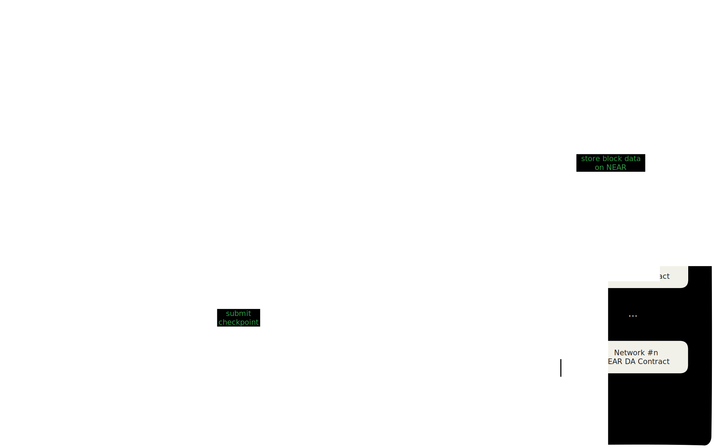

# Overview

The NEAR Super Fast Finality Layer (SFFL) aims to provide a fast settlement
layer that allows participating networks to quickly access information from
other networks in a safe way.

In order to achieve this, SFFL leverages both [NEAR](https://near.org) and
[EigenLayer](https://www.eigenlayer.xyz), providing not only a way for
protocols to provide interoperability features by verifying state attestations
secured by staked ETH.

The architecture is comprised of two off-chain actors, the _Operators_ and the
_Aggregator_, the AVS nodes, and multiple on-chain contracts:

* on Ethereum Mainnet, there's the SFFL AVS contract set, which interacts
  directly with EigenLayer contracts.
* on rollup networks, there are SFFL verifier contracts to check
  network state attestations.
* on NEAR, there is a NEAR DA contract for each participating rollup network
  which serves as a medium for storing historical block data.

## Architecture

Below is a diagram representation of SFFL's architecture. Let's consider, as an
example, `HelloProtocol`, a very primitive protocol in which users want to send
and receive _hello_ from one network to another. In abstract terms, this is the
base feature of every bridging protocol. It's a good idea to refer to this
diagram whenever any of the interactions seems unclear.

### Ethereum

SFFL's is enabled to provide the fast finality guarantees by leveraging the
architecture of EigenLayer \_Actively _Valildated Service_. EigenLayer AVS
allows the coordination of validators in distributed network towards a common
goal. EigenLayer allows validators to reuse Ethereum stake as the mechanism
for incentivization.

<!-- TODO: fix the last sentence -->

In order for SFFL to have economic security, users must first restake ETH into
EigenLayer, becoming _Restakers_. This means the SFFL architecture actually
starts on Ethereum, as the
[EigenLayer core contracts](https://github.com/Layr-Labs/eigenlayer-contracts/tree/dev/docs)
live there.

The SFFL has a set of smart contracts which, in EigenLayer terms, are called
_middleware_. The _middleware_ contracts are directly connected to the
EigenLayer core contracts. The AVS contracts facilitate the interaction between
the off-chain node with the EigenLayer protocol. Operations such as registering
as an _Operator_ (a validator) and validating task resolutions are handled by
the AVS contracts. _Restakers_ can delegate their restaked Eth to _Operators_,
who will then validate the AVS on their behalf.

### NEAR Data Availability

To settle rollup transactions on NEAR, participating rollups must post block
data to NEAR. NEAR DA is the data availability solution used for hosting the
rollup block data.

The data posted to NEAR DA is indexed by the AVS nodes. The nodes compare the
posted blocks with their own full nodes' data and agree on the network state.

The role of posting block data to NEAR DA is separated from the rollup
sequencer, into a _Relayer_ role. This Relayer constantly posts block data to
NEAR DA, providing a fast and public ledger to the current network state.
The seperation of the Relayer allows for participating rollups to use the
fast finality layer without any modifications to their sequencer implementation.

Since the AVS nodes compare the data posted by the Relayer with their local
full nodes, that even if the _Relayer_ acts maliciously, this doesn't mean the
AVS will necessarily agree with it.

There's an example Relayer implementation, but it should slightly change
depending on the specific network and stack, as it should ideally be operated
by the sequencer.

### SFFL off-chain nodes

SFFL nodes attest to the state root of rollup after executing the block. The
individual signatures are aggregated off-chain and submitted to Ethereum and
participating rollups.

An SFFL Operator, runs a full node for each of the participant networks
(including Ethereum), as well as a NEAR full node and a NEAR DA indexer. The
simplified flow can be described through the following:

1. The indexer captures a block posted to NEAR DA for one of the networks and
   sends it to the operator node.
1. The operator node retrieves and parses the block.
1. The operator node checks the block is the same as the one in their
   self-hosted network full node.
   1. If the blocks do not match, then the block posted by the Relayer are
      wrong and the SFFL nodes do not sign any state root.
1. The operator node, through their BLS keypair, signs a message attesting
   that for the network in question in that block height, the state root is the
   one that was fetched.
1. The operator sends the signed message to the Aggregator.

The Aggregator collects BLS signatures from multiple SFFL nodes. When
the desired quorum of operator power (i.e. restaked amount) is reached, then
all of the signatures are aggregated into one and made available through an
API.

This aggregated signature, when validated by a program that has access to the
operator set, is the equivalent of "_A sufficient amount of operators have
agreed that, for network `N`, at block height `H`, the state root is `S`_".
By verifying the aggregated signatures a rollup can be sure of other rollup,
allowing seamless cross-chain interoperability!

Apart from voting on the state roots of rollups, SFFL operators also track
operator set updates on the AVS contracts and emit attestations for those in a
somehow similar process - instead of expecting block data externally, it simply
subscribes to Ethereum updates through its full node. The importance of that
will be discussed in [Network Registry](#network-registry).

For more details on the messaging flow, please read
[Messaging and Checkpoints](./messaging_and_checkpoints.md).

### Network Registry

The _Registry_ contract is a vital component of the SFFL architecture.
There is a _Registry_ contract on each rollup. This contract is used to verify
the state root attestations.

In order to verify the signature, the Registry contract have access to the AVS
operator set - otherwise, it can't know if a signer is an operator or not, much
less whether the attestation has passed quorum or not.

In fact SFFL Registry contracts have two roles - 1) store a copy of the
operator set and 2) verifying attestations. To keep the operator set
up to date, the Registry contract accepts attestations for operator set updates.

The operator set relies on the AVS attestations to be
up-to-date - the AVS operators themselves agree on each operator set delta.
This is an easily verifiable 'task' in terms of slashing, and implements the
cross-chain messaging necessary for communicating this from Ethereum to the
other participant networks.

The operator set update is an Aggregator task by initially, but it would not be
restricted to it - any user can submit it. Changes to this mechanism,
especially in terms of economic incentives, are planned.

### Checkpoint Tasks

As defined in the [EigenLayer AVS guidelines](https://docs.eigenlayer.xyz/eigenlayer/avs-guides/first-steps-towards-designing-an-avs),
AVS operation should be represented in terms of units of work called _Tasks_.
These tasks are defined in the AVS contracts on Ethereum. The AVS payment and
slashing are based on the operators fulfilling these tasks in a correct manner.

In the SFFL architecture, the attestations defined above are not defined as a
_Task_ - rather, they are defined as \_Message_s. The _Task_ for SFFL nodes is
defined as the amalgamation of all the _Message_ types, specifically the unit
of work required from all validators is to attest on the aggregation
(more specifically _Merkleization_) of messages in a time range.

Using the merkleization of aggregated messages, the existance or non-existance
of a message in a time range is verified on Ethereum through the task response.
The verification of the aggregated message is used for slashing and payment
processing.

For more details on checkpoints, refer to
[Messaging and Checkpoints](./messaging_and_checkpoints.md).

### User Flow

Finally - how can SFFL be used by a user or protocol? The integration is
actually quite simple. Let's follow the HelloProtocol example: consider a user
had sent a "hello!" message on Network #2 to Network #1, recording it on
Network #2's state.

Eventually, the block in which the message was submitted gets considered in
SFFL and a state root attestation was collected for the Network #2's state.
Through it, anyone can submit the attestation to any network, not only Network
#1, making Network #2's state available on it.

The HelloProtocol (off-chain) app would then keep track of SFFL's state and,
as such, would be able to fetch this attestation as soon as it's available.
This complexity can be simply abstracted from the user.

When the attestation is done, the protocol lets the user consume the "hello!"
on Network #1 by sumbitting a transaction that indicates the storage proof
of the message on Network #2 and the attestation from SFFL. Again, the UX is
not really impacted - the proof should also be generated in the background.

This data is then relayed by the HelloProtocol contract to the SFFL Registry
contract, which validates the attestation and checks the storage proof - and
there is our "hello!"!

In easier terms, in UX terms, all of the parts of this integration that, to
the user, may seem strange, can be simply abstracted from them. In
implementation terms, it's a matter of fetching the attestation and the proof,
as well as linking the protocol's contracts to SFFL's and relaying the fetched
data.
